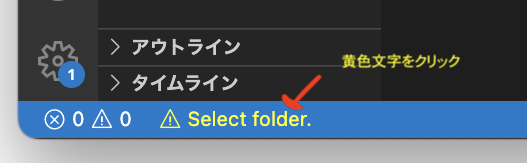
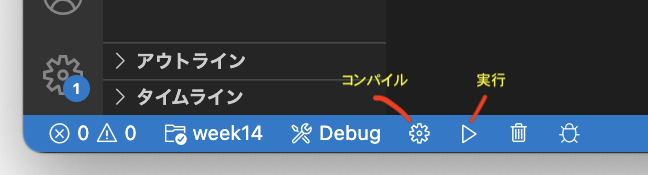

# VSCode + gcc (clang) で開発する流れ
- 参考
  - [Using Clang in Visual Studio Code](https://code.visualstudio.com/docs/cpp/config-clang-mac)
- ＜目次＞
  - <a href="#code-runner">自動実行するための拡張インストール</a>
  - <a href="#new-project">プロジェクト作成方法</a>

<hr>

## <a name="code-runner">自動実行するための拡張インストール</a>
- VSCodeを起動し、``⌘+シフト+x`` を入力して拡張機能メニューを表示する。（歯車アイコンから拡張機能を選んでも良い）
- 検索窓に ``c`` と入力し、Microsoft提供の「C/C++」をインストールする。
- 検索窓に ``c`` と入力し、franneck94提供の「C/C++ Runner」をインストールする。インストール完了後、有効にする。

<hr>

## <a name="new-project">プロジェクト作成方法</a>
- step 1: プロジェクトディレクトリを作成。
  - 例えば ``~/prog2/`` がすでに存在していて、そこに ``week14`` というプロジェクトを作るなら、``mkdir ~/prog2/week14`` で作成。以下はこの想定でのコマンド例。
- step 2: 作成したディレクトリに移動。
  - ``cd ~/prog2/week14``
- step 3: 空のソースファイルを作成。（後からも可能）
  - ``touch sample1.c``
- step 4: VSCodeでプロジェクトを開く。
  - ``code .``
- step 5: ファイル編集して保存する。
  - sample1.cを開き、例題1なり何かしらCのコードを記述して保存する。
```C
//コード例
#include <stdio.h>

int main(){
    printf("hello");
    return 0;
}
```
- step 6: ビルド＆実行。
  - 手動でやる場合：
    - ターミナルで手動コンパイル。
      - ``gcc -o hoge sample1.c``
      - ``-o`` は、コンパイル後に生成する実行ファイル名を指定するためのオプション。上記ではhogeと指定している。指定しなかった場合には ``a.out`` というファイル名になる。
    - ターミナル上で実行ファイルを指定して実行。hogeと指定したなら下記のように実行する。
      - ``./hoge``
  - 自動でやる場合：
    - プロジェクトフォルダの設定。
      - VSCode画面下部に、黄色で Select folder と書かれている箇所をクリック。プロジェクトフォルダ（今回はweek14）を選択。
      - 
    - コンパイル。
      - コンパイルしたいファイルを選択。この状態でウィンドウ下部の鍵アイコンをクリック。
      - 
    - 実行。
      - ウィンドウ下部の ▷ をクリック。
- step option: デバッグ実行。
  - Javaと同様の流れで可能。
